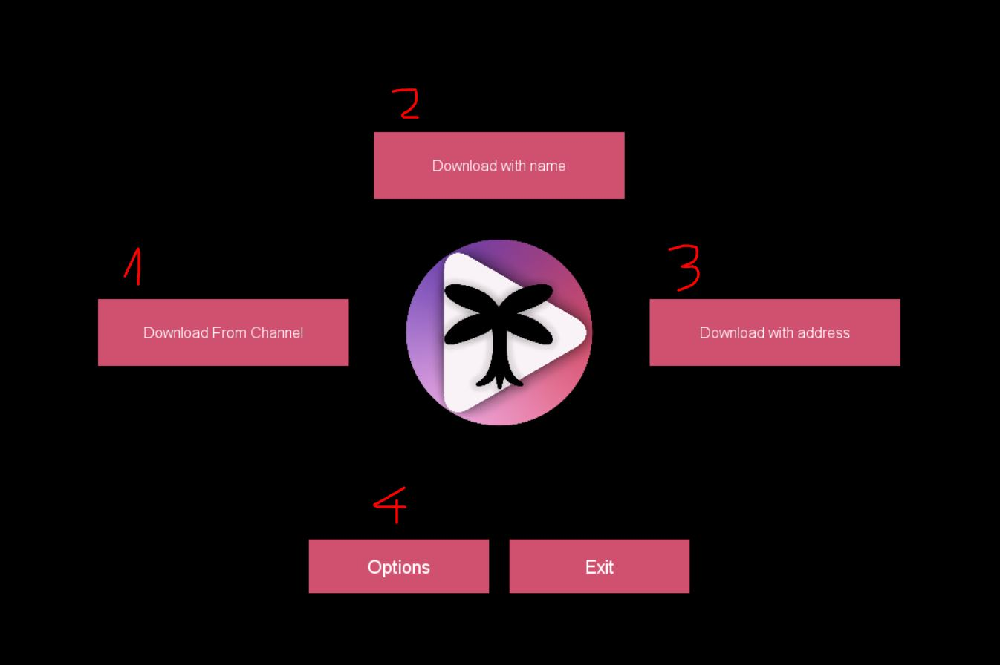
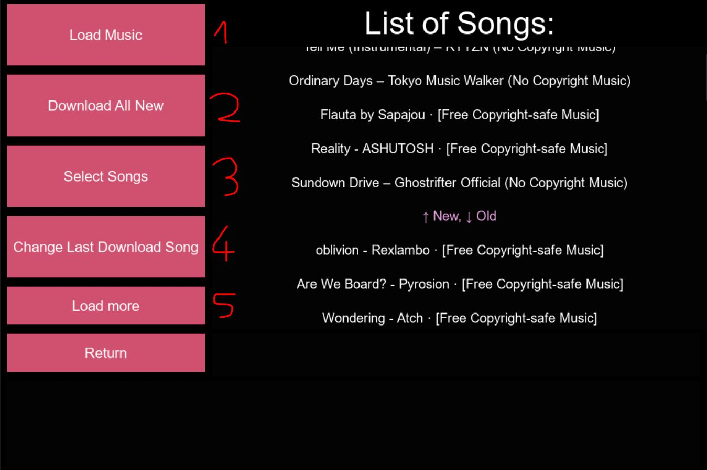

# Chill Music Downloader 

Program downloads .mp3, .mp4 and other audio/video files to destination folder, from youtube.com, by address, or name of video

CMDownloader also remember last downloaded video from each channel, so you can download new released videos from your favourite youtube channels by few clicks !!!

## Main menu

1. Downloading multiple videos from given channel
2. Section which finds 5 videos with most similar name to that entered by user, then enable uster to download one of them
3. Download video by address url
4. Menu with options, enable to change save path, file extension, channel

### Downloading from channel menu

1. Load 50 lastest videos from channel
2. Download all new videos so, that are bellow last download song
3. Enable to select exacly what songs to download
4. Changes the last downloaded video name to given by user
5. Load all videos from channel or that much as Youtube Api will allow

## Main python modules
* requests
* BeautifulSoup
* youtube_dl
* kivy
* google-api-python-client

## Notes

App uses [YouTube Data API](https://developers.google.com/youtube/v3) so have limited count of queries send to api per day

To correct work, app must also have ffmpeg.exe file in app folder, can be download from [here](https://ffmpeg.org/download.html)
