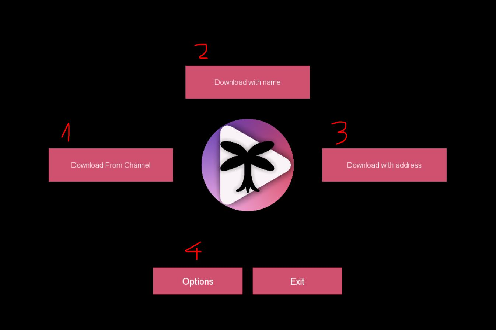
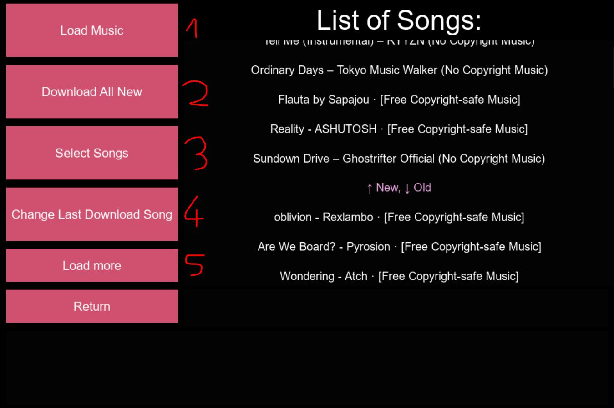

# Chill Music Downloader 

Program downloads .mp3, .aac and others audio files to destination folder, from youtube.com, by address, or name of song

CMDownloader also remember last downloaded song from each channel, so you can download new released songs from your favourite youtube channels by few clicks !!!

## Main menu

1. Downloading multiple music from given channel
2. Section which finds 5 videos with most similar name to that entered by user, then enable uster to download one of them
3. Dowload video by address url
4. Menu with options, enable to change save path, file extension, channel

### Downloading from channel menu

1. Load 50 lastest videos from channel
2. Download all new videos so, that are bellow last download song
3. Enable to select exacly what songs to download
4. Changes the last download song name to given by user
5. Load all music from channel or that much as Youtube Api will allow

## Used python modules
* requests v2.24.0
* BeautifulSoup v4.9.1
* youtube_dl v2020.5.8
* kivy v1.11.1
* google-auth v1.18.0
* google-api-python-client v1.11.19

!To correct work, app must also have ffmpeg.exe file in root folder, can be download from [here] (https://ffmpeg.org/download.html)